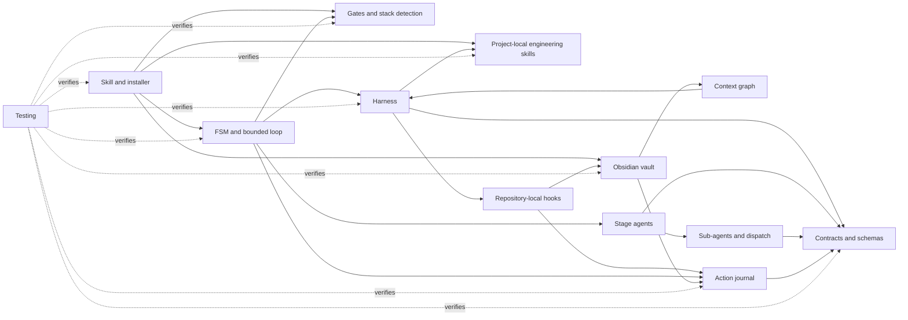

# Documentation

Documentation of the Hermes SDD Orchestrator. Every page is kept in sync with the code: [tests/test_docs.py](../tests/test_docs.py) fails when a page falls behind, and [tools/check_docs_sync.py](../tools/check_docs_sync.py) rejects an orchestration change that does not update its page. How that works: [Maintaining the docs](maintaining-docs.md).

## Start here

| If you want to… | Read |
| --- | --- |
| Understand the whole system in five minutes | [Overview](overview.md) |
| See how the layers depend on each other | [Architecture](ARCHITECTURE.md) |
| Review the Jev decision-layer diagnosis and benchmark protocol | [Jev decision-layer evaluation](reports/jev-decision-layer-evaluation.md) |
| Install the orchestrator in a project | [Skill and installer](components/skill-and-installer.md) → [Gates and stack detection](components/gates-and-stack-detection.md) |
| Follow one demand from request to DONE | [Overview — life of a demand](overview.md#life-of-a-demand) |
| Change the orchestration | [Maintaining the docs](maintaining-docs.md) and [CONTRIBUTING](../CONTRIBUTING.md) |
| Look up a term | [Glossary](glossary.md) |

## Component pages

Each page owns a set of files (see [doc-map.json](doc-map.json)) and is the single place that documents them.

| Page | Covers |
| --- | --- |
| [Skill and installer](components/skill-and-installer.md) | `SKILL.md`, `install_project.py`, the `.hermes.md` entry point, what is installed where |
| [Project-local engineering skills](components/project-local-skills.md) | Backend, architecture and database playbooks; progressive loading; playbook-to-slice binding |
| [FSM and bounded loop](components/fsm-and-loop.md) | The stage machine, modes (`MANUAL`, `PAUSED`, `BOUNDED_AUTO`, `LOCAL_DELIVERY`), budgets, planner and drivers |
| [Harness: stage context and bounded correction](components/harness.md) | Per-dispatch context budget and slice contract, approval reuse, bounded execute → verify → correct loop |
| [Action journal and recovery](components/action-journal.md) | Write-ahead journal, action lifecycle, rollover, recovery decisions |
| [Contracts and schemas](components/contracts-and-schemas.md) | Executor and review result envelopes, their JSON Schemas and the protocol validator |
| [Gates and stack detection](components/gates-and-stack-detection.md) | Validation gates, `GATES.md` configuration, `detect_stack.py` for any language |
| [Stage agents](components/stage-agents.md) | One brief per FSM stage |
| [Sub-agents and dispatch](components/sub-agents.md) | The 4 sub-agent briefs (including the global `pr-reviewer`), the playbooks that replaced the other specialists, and the "do not dispatch" default |
| [Repository-local Hermes hooks](components/hooks.md) | Opt-in shell hooks for slice scope, verification evidence, bounded STATE context and sub-agent audit events |
| [Obsidian vault](components/obsidian-vault.md) | Vault binding, write containment, worktree bootstrap and migrations |
| [Context graph](components/context-graph.md) | Modules, rules, tests and decisions as connected notes; querying related context before acting |
| [Testing](components/testing.md) | Both test suites and what each test file guarantees |

## How the pages connect

