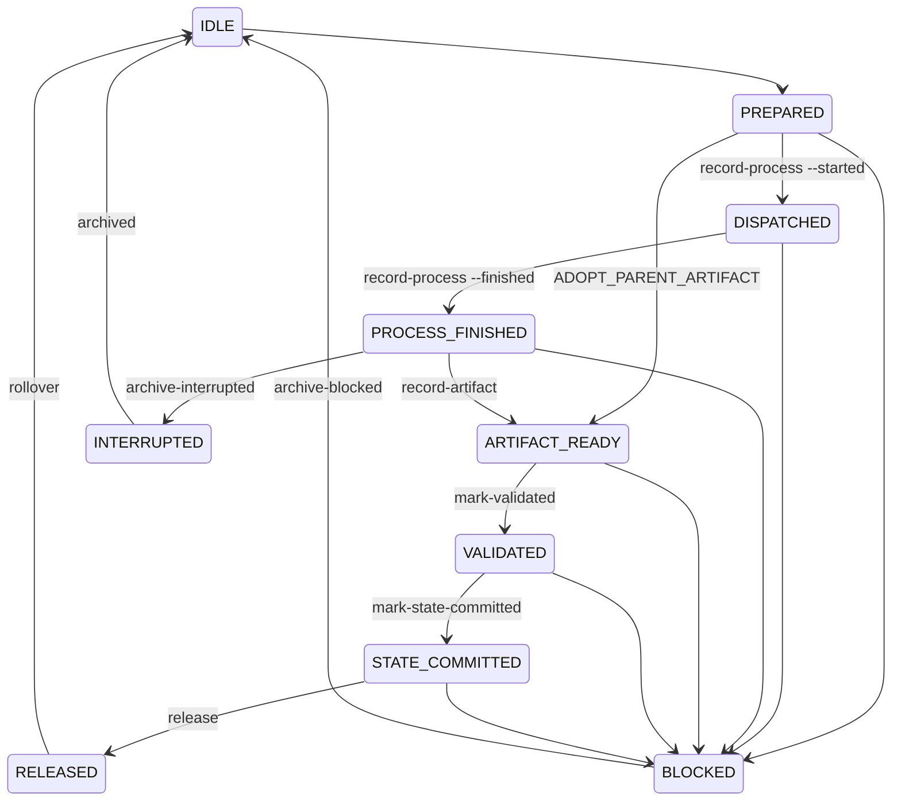

# Action journal and recovery

[Docs index](../README.md) · Related: [FSM and bounded loop](fsm-and-loop.md), [Contracts and schemas](contracts-and-schemas.md), [Obsidian vault](obsidian-vault.md)

**Files:** `policies/ACTION_RECOVERY.md`, `runtime/action_journal.py`, `schemas/ACTION_JOURNAL_SCHEMA.json`.

`ACTION_JOURNAL.json` is a write-ahead log for **one** in-flight worker action. `STATE.md` remains the source of truth for the demand. The journal exists so that a crash between "worker finished" and "STATE saved" can be recovered without redispatching the worker and without losing its result. Every journal state has a documented command that leaves it, so the controller never hand-edits the journal or STATE. `ACTION_RECOVERY.md` is the procedural table the controller follows; this page explains the design.

## Where the files live

`action_journal.py paths` prints the canonical paths for the current worktree, so the controller never guesses `--history-dir`:

| Field | Obsidian storage (default) | `--local-storage` |
| --- | --- | --- |
| `storage` | `OBSIDIAN` | `LOCAL` |
| `runtime_dir` | `<vault>/<project>/.hermes-runtime/<worktree-slug>/` ([runtime location](obsidian-vault.md#runtime-location)) | `.hermes/orchestration/` |
| `journal` | `<runtime_dir>/ACTION_JOURNAL.json` | same |
| `history_dir` | `<runtime_dir>/action-journal-history` | same |
| `state` / `incidents` | `<runtime_dir>/STATE.md` / `INCIDENTS.md` | same |

It also returns `workspace` (the Git worktree, from `--repo` or the working directory for a vault-resident controller; the install root for a repository-local one). A repository-local controller asked about another worktree returns `CONTROLLER_WORKSPACE_MISMATCH`; a vault controller run outside a worktree returns `WORKSPACE_REQUIRED`.

**Trust boundary.** History and STATE writes are accepted in two places only:

- inside the journal's worktree (legacy layout): STATE must resolve inside the resolved worktree, which rejects a symlinked ancestor escape; history is opened from the resolved worktree with lexical, no-follow child components;
- inside **this worktree's** runtime directory of the binding installed with the controller (`obsidian_binding._installed_container_binding`): STATE must be exactly `<runtime_dir>/STATE.md`. A binding planted in the repository, the binding of another vault and the `HERMES_OBSIDIAN_VAULT` override are ignored for this decision, and another worktree's runtime is refused (`HISTORY_PATH_UNSAFE`, `STATE_PATH_UNSAFE`).

Every component of the runtime path below the vault root is checked with `lstat` (no symlink, no `..`; `RUNTIME_PATH_UNSAFE` otherwise). Only the vault root the binding names is resolved once (so a symlink above it, such as macOS `/tmp`, is fine and callers may use either spelling). History is then written through directory descriptors opened one component at a time from `/` with `O_NOFOLLOW`, re-verified before the final link, so swapping any ancestor for a symlink between check and write fails. An invalid installed binding fails closed (`RUNTIME_BINDING_UNSAFE`, surfaced as `HISTORY_PATH_UNSAFE` / `STATE_PATH_UNSAFE`). A controller copy loaded without `obsidian_binding` (the installer loads `action_journal.py` by path) supports only the legacy layout.

## Lifecycle



Statuses: `IDLE`, `PREPARED`, `DISPATCHED`, `PROCESS_FINISHED`, `ARTIFACT_READY`, `VALIDATED`, `STATE_COMMITTED`, `RELEASED`, `BLOCKED`, `INTERRUPTED`. Every status change is checked against its predecessor and written atomically (temporary file, `fsync`, `os.replace`).

- **Dispatch guard:** `record-process --started` succeeds only from a `PREPARED` action that `recover` classifies `DISPATCH_ALLOWED` (`DISPATCH_NOT_PREPARED` otherwise, `ARTIFACT_PENDING` when the final-message path already holds a file). With `--prompt-sha256` the prompt hash must equal the prepared `prompt_hash` (`PROMPT_HASH_MISMATCH`). A launcher passes it so a prompt that changed after `prepare` is never sent.
- **Process result:** `record-process --finished --exit-code N` is safe in a launcher's `finally` block: repeating the recorded exit code returns the journal unchanged, a different code is `PROCESS_RESULT_CONFLICT`, and no recorded start is `PROCESS_NOT_STARTED`. On a `BLOCKED` action that had started, it records the missing result without changing status.
- **Artifact:** `record-artifact` hashes the final message opened without following a symlink. A missing file, directory or symlink returns `ARTIFACT_MISSING` and the journal stays `PROCESS_FINISHED`, so `archive-interrupted` remains possible. Presence is one test everywhere (`final_message_is_regular`: `lstat` says regular file): `recover` (`artifact_present`), `record-artifact`, the `archive-interrupted` precondition and the `archive-invalid`/`classify-invalid` re-hash all agree, so a symlink to a valid-looking file makes `recover` return `ARCHIVE_INTERRUPTED_REQUIRED`, never a `RECONCILE_ARTIFACT` that `record-artifact` would refuse. Before dispatch, `final_path_occupied` (anything at the path, a dangling symlink included) blocks `record-process --started` with `ARTIFACT_PENDING` and makes `recover` return `BLOCKED`/`ARTIFACT_PENDING`. `mark-validated` re-hashes the file and refuses one that changed since it was recorded (`ARTIFACT_CHANGED`) or that is classified invalid (`ARTIFACT_CLASSIFIED_INVALID`).
- **Ids as path components:** the ticket and action id name the history entry, so both must match `TICKET_PATTERN` (the pattern of `sdd.py`: first character a letter or digit, then letters, digits, `.`, `_`, `-`; ticket ≤ 64 characters, action id ≤ 160 via `ACTION_ID_PATTERN`). That refuses `.`, `..`, separators and a leading dash. `prepare` refuses unsafe ids (`ACTION_ID_UNSAFE`, `next_command` = `prepare`); `atomic_create_history` and the adoption parent lookup refuse them (`HISTORY_PATH_UNSAFE` / not found); `recover` on a journal that already holds unsafe ids returns `BLOCKED`/`JOURNAL_INCONSISTENT` with `block`, `archive-interrupted` refuses it (`JOURNAL_ARCHIVE_INTERRUPTED_INCOMPLETE`, `next_command` = `block`), and `archive-blocked` (like `rollover` for an already-committed action) files the evidence under `NO-TICKET/NO-ACTION-<hash>.json` instead of the unsafe names.
- **Rollover:** after `RELEASED`, `rollover` archives the journal to `<history_dir>/<ticket>/<action_id>.json` (append-only; same hash is idempotent, a different hash fails with `JOURNAL_HISTORY_CONFLICT`) and resets the active journal to pristine `IDLE`. Going from `RELEASED` straight to `prepare` is forbidden.
- **Interrupted (timeout or crash):** `DISPATCHED` → `record-process --finished --exit-code 124` → `recover` returns `ARCHIVE_INTERRUPTED_REQUIRED` with the exact `archive-interrupted --history-dir` command → `archive-interrupted` records `INTERRUPTED` history and opens a pristine journal → `recover` is `DISPATCH_ALLOWED` → `prepare` a retry with a new `action_id` and `parent_action_id`. The original is never redispatched.
- **Adopting a late artifact:** when the interrupted parent's own final message turns up complete, `prepare` with `retry_mode: ADOPT_PARENT_ARTIFACT` adopts it without a new executor call. `prepare` reads the parent from history (`--history-dir`, default the journal's sibling `action-journal-history`) through no-follow descriptors and requires an `INTERRUPTED` parent of the same ticket, stage and worktree whose `final_message_path` equals the adopted `parent_artifact_path` = `final_message_path`, a matching `parent_artifact_sha256`, and no process evidence (`ADOPTION_PARENT_NOT_FOUND`, `ADOPTION_NOT_ALLOWED`, `ADOPTION_ARTIFACT_MISMATCH`). `recover` returns `RECONCILE_ARTIFACT` with `record-artifact`, which re-verifies the hash and moves `PREPARED` → `ARTIFACT_READY`; the normal validate → STATE commit path follows. `record-process --started` is refused with `ADOPTION_DISPATCH_FORBIDDEN`.
- **Blocked:** `archive-blocked --reason <text> --history-dir <dir>` archives a `BLOCKED` journal, a live `INTERRUPTED` one, or a dirty `IDLE` one (stored under `NO-TICKET/` with a content-derived name when it has no identity), appends `ARCHIVED_BLOCKED: <reason>` to the snapshot's incidents, opens a pristine journal and mirrors the action to the wiki. It refuses live actions and pristine `IDLE` (`JOURNAL_ARCHIVE_BLOCKED_NOT_ALLOWED`) and an empty reason (`ARCHIVE_REASON_REQUIRED`).
- **Blocking an action:** the `block` command (and every other module, such as `sdd.py reprepare`) goes through the public `block_action(path)`, which moves the live action to `BLOCKED` and mirrors the incident to the wiki. Callers never reach into the module's private transition helper, so the journal keeps a single enforced door to `BLOCKED`.
- **Invalid artifact:** `classify-invalid`, `recover-blocked-invalid` and `archive-invalid` handle an artifact that failed [contract validation](contracts-and-schemas.md).
- **Wiki record:** `prepare`, `block`, `rollover`, `archive-interrupted`, `archive-invalid` and `archive-blocked` also record the action (outcome `PREPARED`, `BLOCKED`, `RELEASED`, `INTERRUPTED` or `INVALID`; a `VALID` artifact's executor result is included only when it is the exact validated file) in the project's Obsidian wiki under `raw/articles/<ticket>/actions/`, and `record_incident` records each incident under `incidents/`, through [`wiki_journal.py`](obsidian-vault.md#recording-everything-in-the-wiki-wiki_journalpy). The report gains a `wiki` field (`WRITTEN` with its path, or `SKIPPED` with the reason); a wiki failure never fails the journal operation.
- **Corrective retry:** at most one per action, either `FULL_REPLACEMENT` or `METADATA_OVERLAY`. The overlay is allowed only when functional and TDD evidence passed and nothing drifted. `retry_mode` is one of `RETRY_MODES`: `FULL_REPLACEMENT`, `METADATA_OVERLAY`, `ADOPT_PARENT_ARTIFACT`.

## Recovery decisions

`recover` is diagnostic only. It never runs a worker. It returns one of `RECOVERY_DECISIONS`: `DISPATCH_ALLOWED`, `RECONCILE_ARTIFACT`, `STATE_COMMIT_REQUIRED`, `ALREADY_COMMITTED`, `CORRECTIVE_RETRY_AVAILABLE`, `WAIT_OR_MANUAL_REVIEW`, `ARCHIVE_INTERRUPTED_REQUIRED`, `BLOCKED` or `RELEASED`, always with `reason`, `next_step` and an exact `next_command` (absolute interpreter and script path, quoted journal and history paths, `<...>` placeholders for values only the controller knows). Every `BLOCKED` carries a `stop_reason`: `ACTION_BLOCKED`, `ACTION_RECOVERY_REQUIRED` (live `INTERRUPTED`), `DIRTY_OR_INCONSISTENT_IDLE`, `RETRY_BUDGET_REACHED`, `STATE_DESYNC`, `ARTIFACT_PENDING` (an undispatched action whose final-message path is occupied), `JOURNAL_INCONSISTENT`, or the STATE error code; `ARCHIVE_INTERRUPTED_REQUIRED` carries `EXECUTOR_PROCESS_ENDED_WITHOUT_ARTIFACT`. The [bounded planner](fsm-and-loop.md#actions) turns `RECONCILE_ARTIFACT` and `STATE_COMMIT_REQUIRED` into a `RECOVER_PENDING_ACTION` first step.

> Never redispatch while an artifact for the current action exists and has not been classified.

## CLI

```text
python3 <controller>/runtime/action_journal.py <command> --journal <path> [options] [--json]
python3 <controller>/runtime/action_journal.py paths [--repo <worktree>] [--json]
```

Commands: `init`, `prepare`, `record-process`, `record-artifact`, `mark-validated`, `classify-invalid`, `recover-blocked-invalid`, `prepare-state-commit`, `mark-state-committed`, `release`, `rollover`, `archive-interrupted`, `archive-invalid`, `archive-blocked`, `block`, `inspect`, `recover`, `paths`.

| Flag | Used by |
| --- | --- |
| `--journal` | every command except `paths` (missing: `JOURNAL_REQUIRED` with the `paths` command) |
| `--payload` | `init` (workspace JSON), `prepare` (full action JSON) |
| `--started` / `--finished` + `--exit-code` | `record-process` |
| `--prompt-sha256` | `record-process --started` |
| `--state-path`, `--expected-before-hash`, `--expected-after-hash` | `prepare-state-commit`; `--expected-after-hash` also for `mark-state-committed` |
| `--committed-after-hash` | `mark-state-committed`, compatibility only; it is compared, never trusted as proof |
| `--history-dir` | `rollover`, `archive-interrupted`, `archive-invalid`, `archive-blocked`; optional for an `ADOPT_PARENT_ARTIFACT` `prepare` |
| `--invalid-field` (repeatable) | `classify-invalid`, `recover-blocked-invalid` |
| `--reason` | `archive-blocked` |
| `--repo` | `paths` |
| `--json` | structured output |

Errors exit with code 2 and `{status, message, next_step, next_command?}`. Every `JournalError` code has an entry in `NEXT_STEPS`, enforced by a test. There is no force, overwrite, history reset or validation bypass option. `mark-state-committed` rereads STATE and computes its hash itself. It rejects `STATE_NOT_COMMITTED` and `STATE_COMMIT_HASH_MISMATCH`.
