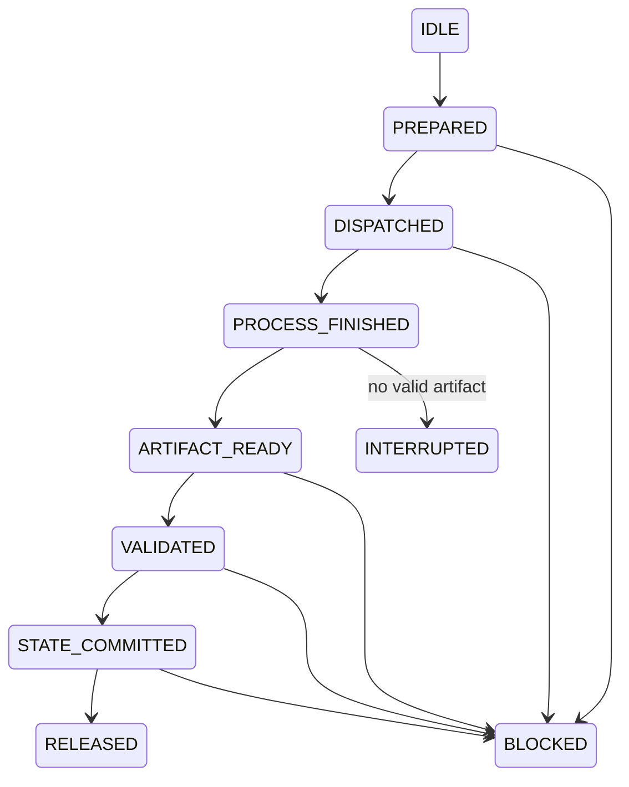

# Action journal and recovery

[Docs index](../README.md) · Related: [FSM and bounded loop](fsm-and-loop.md), [Contracts and schemas](contracts-and-schemas.md), [Obsidian vault](obsidian-vault.md)

**Files:** `policies/ACTION_RECOVERY.md`, `runtime/action_journal.py`, `schemas/ACTION_JOURNAL_SCHEMA.json`.

`ACTION_JOURNAL.json` is a write-ahead log for **one** in-flight worker action. `STATE.md` remains the source of truth for the demand. The journal exists so that a crash between "worker finished" and "STATE saved" can be recovered without redispatching the worker and without losing its result. Its location is the orchestration root, or the [vault runtime directory](obsidian-vault.md#runtime-location) once a worktree is bound to a vault.

## Lifecycle



Statuses: `IDLE`, `PREPARED`, `DISPATCHED`, `PROCESS_FINISHED`, `ARTIFACT_READY`, `VALIDATED`, `STATE_COMMITTED`, `RELEASED`, `BLOCKED`, `INTERRUPTED`. Every status change is checked against its predecessor and written atomically (temporary file, `fsync`, `os.replace`).

- **Rollover:** after `RELEASED`, `rollover` archives the journal to `action-journal-history/<ticket>/<action_id>.json` (append-only; same hash is idempotent, a different hash fails with `JOURNAL_HISTORY_CONFLICT`) and resets the active journal to pristine `IDLE`. Going from `RELEASED` straight to `prepare` is forbidden.
- **Interrupted:** a process that finished without a valid artifact is archived with `archive-interrupted`. A retry uses a new `action_id` with `parent_action_id`. The original is never redispatched.
- **Invalid artifact:** `classify-invalid`, `recover-blocked-invalid` and `archive-invalid` handle an artifact that failed [contract validation](contracts-and-schemas.md).
- **Wiki record:** `prepare`, `block`, `rollover`, `archive-interrupted` and `archive-invalid` also record the action (outcome `PREPARED`, `BLOCKED`, `RELEASED`, `INTERRUPTED` or `INVALID`; a `VALID` artifact's executor result is included only when it is the exact validated file) in the project's Obsidian wiki under `raw/articles/<ticket>/actions/`, and `record_incident` records each incident under `incidents/`, through [`wiki_journal.py`](obsidian-vault.md#recording-everything-in-the-wiki-wiki_journalpy). The report gains a `wiki` field (`WRITTEN` with its path, or `SKIPPED` with the reason); a wiki failure never fails the journal operation.
- **Corrective retry:** at most one per action, either `FULL_REPLACEMENT` or `METADATA_OVERLAY`. The overlay is allowed only when functional and TDD evidence passed and nothing drifted.

## Recovery decisions

`recover` is diagnostic only. It never runs a worker. It returns one of `DISPATCH_ALLOWED`, `RECONCILE_ARTIFACT`, `STATE_COMMIT_REQUIRED`, `ALREADY_COMMITTED`, `CORRECTIVE_RETRY_AVAILABLE`, `WAIT_OR_MANUAL_REVIEW`, `BLOCKED` or `RELEASED`. The [bounded planner](fsm-and-loop.md#actions) turns `RECONCILE_ARTIFACT` and `STATE_COMMIT_REQUIRED` into a `RECOVER_PENDING_ACTION` first step.

> Never redispatch while an artifact for the current action exists and has not been classified.

## CLI

```text
python3 .hermes/orchestration/runtime/action_journal.py <command> --journal <path> [options] [--json]
```

Commands: `init`, `prepare`, `record-process`, `record-artifact`, `mark-validated`, `classify-invalid`, `recover-blocked-invalid`, `prepare-state-commit`, `mark-state-committed`, `release`, `rollover`, `archive-interrupted`, `archive-invalid`, `block`, `inspect`, `recover`.

| Flag | Used by |
| --- | --- |
| `--journal` | every command |
| `--payload` | `init` (workspace JSON), `prepare` (full action JSON) |
| `--started` / `--finished` + `--exit-code` | `record-process` |
| `--state-path`, `--expected-before-hash`, `--expected-after-hash` | `prepare-state-commit`; `--expected-after-hash` also for `mark-state-committed` |
| `--committed-after-hash` | `mark-state-committed`, compatibility only; it is compared, never trusted as proof |
| `--history-dir` | `rollover`, `archive-interrupted`, `archive-invalid` |
| `--invalid-field` (repeatable) | `classify-invalid`, `recover-blocked-invalid` |
| `--json` | structured output |

Errors exit with code 2 and a stable `status` code. There is no force, overwrite, history reset or validation bypass option. `mark-state-committed` rereads STATE and computes its hash itself. It rejects `STATE_NOT_COMMITTED` and `STATE_COMMIT_HASH_MISMATCH`.
