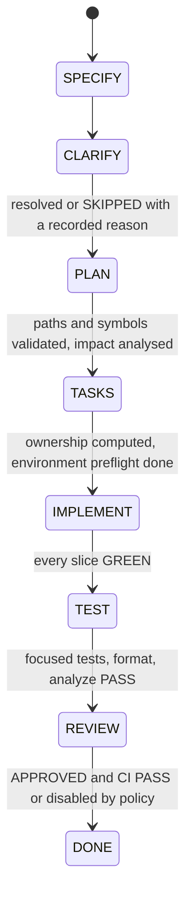

# FSM and bounded loop

[Docs index](../README.md) · Related: [Action journal](action-journal.md), [Stage agents](stage-agents.md), [Gates](gates-and-stack-detection.md), [Contracts](contracts-and-schemas.md)

**Files:** `policies/LOOP_POLICY.md`, `policies/BOUNDED_AUTOMATION.md`, `policies/BOUNDED_RUN_DRIVER.md`, `runtime/bounded_run_planner.py`, `runtime/bounded_run_driver.py`, `runtime/bounded_loop_driver.py`, `schemas/BOUNDED_RUN_PLAN_SCHEMA.json`.

`LOOP_POLICY.md` is the authoritative policy and is written in Portuguese. The three Python tools are **pure**: they read JSON snapshots and return decisions. They never run a worker, write STATE, touch Git or activate a mode. The controller performs every effect.

## The FSM



Only `CLARIFY` may be skipped, and only with a recorded reason. Each stage has its own brief ([Stage agents](stage-agents.md)) and returns a [contract](contracts-and-schemas.md). Transition conditions are listed in `LOOP_POLICY.md` §6.

## Modes

| Mode | Behavior |
| --- | --- |
| `MANUAL` (default) | Run exactly the requested action, then stop. |
| `PAUSED` | Read and explain only. |
| `BOUNDED_AUTO`, schema 1 (legacy) | Continue through a deterministic plan the user approved. A new round needs a new preview and a new confirmation. |
| `LOCAL_DELIVERY`, schema 2 | Not a separate mode value: `schema_version: 2` + `local_delivery` + `loop.mode: BOUNDED_AUTO`. A single explicit authorization is bound to ticket, scope hash, worktree and **cumulative** limits. Replanning never requests new approval and never resets usage. |

Default schema 1 budgets per round: 3 stage transitions, 8 executor calls, 1 corrective retry per action, 3 TDD slices, 1 investigation expansion per stage, 2 review cycles, 1 CI run, 0 external mutations. Stop reasons are a closed list in `LOOP_POLICY.md` §9; `COST_BUDGET_REACHED`, `NO_NEW_HYPOTHESIS` and `NO_PROGRESS` come from the [correction loop](harness.md). §25 describes the harness checks the controller runs around every dispatch. `TOOLCHAIN_ENVIRONMENT` covers a missing or mismatched SDK or version manager for any language.

## Actions

`bounded_run_planner.py` classifies every action:

| Class | Actions | Executor |
| --- | --- | --- |
| `AUTO_SAFE` | `RECOVER_PENDING_ACTION`, `TEST_FOCUSED`, `FORMAT_CHANGED_FILES`, `ANALYZE`, `EVALUATE_DONE`, `EVALUATE_DONE_WITH_CI_DISABLED`, `STATE_TRANSACTION_UPDATE`, `VERIFY_BASELINE_OWNERSHIP`, `EVALUATE_BUDGETS`, `CLOSE_BOUNDED_RUN` | `HOST` |
| `AUTO_WITH_BUDGET` | `SPECIFY`, `CLARIFY`, `PLAN`, `TASKS`, `IMPLEMENT_SLICE`, `REVIEW`, `CI` | `CODEX` (`HOST` for `CI`) |
| `HUMAN_REQUIRED` | `REOPEN_STAGE_AFTER_RETRY_EXHAUSTED`, `RESOLVE_RECOVERY`, `PROTECTED_FILE_CHANGE`, `MATERIAL_SCOPE_CHANGE`, `ARCHITECTURE_DECISION`, `BACKEND_MUTATION`, `DEV_E2E`, `COMMIT`, `PUSH`, `LINEAR_UPDATE`, `OBSIDIAN_WRITE`, `DESTRUCTIVE_ACTION`, `EXTERNAL_CONTRACT_CHANGE`, `WAIT_OR_MANUAL_REVIEW` | `NONE` |

Gate preconditions are enforced by the planner: `FORMAT_CHANGED_FILES` needs focused tests `PASS`, `ANALYZE` needs tests and format, `REVIEW` needs all three, and `CI` needs review `APPROVED` and CI enabled. Gate commands come from [Gates](gates-and-stack-detection.md).

The snapshot's `implementation.changed_files_available` flag is also accepted under its legacy name `changed_dart_files_available`, so older installations keep validating.

## Tools

### `bounded_run_planner.py` (Phase 2A: preview)

```text
bounded_run_planner.py plan --snapshot s.json --target NEXT_HUMAN_CHECKPOINT [--output plan.json] --json
bounded_run_planner.py validate --plan plan.json --snapshot s.json --json
bounded_run_planner.py classify --action SPECIFY --json
```

Subcommands `plan`, `validate` and `classify`. Flags: `--snapshot`, `--plan`, `--target`, `--output`, `--action`, `--json`. The plan is canonical JSON whose `plan_sha256` is computed without the authorization field. It validates against `BOUNDED_RUN_PLAN_SCHEMA.json` (plan version 1, or 2 for `LOCAL_DELIVERY`).

### `bounded_run_driver.py` (Phase 2B: per-action decision)

```text
bounded_run_driver.py bind --snapshot s.json --plan plan.json --started-at <iso> [--approved-plan-sha256 <sha>] --json
bounded_run_driver.py inspect|validate|next --snapshot s.json --plan plan.json --json
```

Subcommands `bind`, `inspect`, `validate` and `next`. Flags: `--snapshot`, `--plan`, `--started-at`, `--approved-plan-sha256`, `--json`. `bind` attaches a validated plan to a runtime cursor. Schema 1 requires the exact approved hash.

Decisions: `EXECUTE_NEXT`, `ROLLOVER_REQUIRED`, `REPLAN_REQUIRED`, `COMPLETE`, `STOP_BUDGET`, `STOP_HUMAN_REQUIRED`, `STOP_BLOCKED`, `STOP_PLAN_STALE`, `STOP_RECOVERY`.

### `bounded_loop_driver.py` (same-turn continuation)

```text
bounded_loop_driver.py next --snapshot s.json --plan plan.json --json
```

Subcommand `next`. Flags: `--snapshot`, `--plan`, `--json`. Decisions: `CONTINUE`, `STOP`, `ROLLOVER_REQUIRED`. Expected progress (STATE hash, budgets used, recovery after rollover) is not stale. Workspace identity drift is.

## Per-action loop

For every action, the controller follows the same sequence: reread STATE → driver `next` → [journal recovery](action-journal.md) → [stage context check](harness.md#stage-context-manifest-stage_contextpy) → `prepare` → dispatch one worker → validate the [contract](contracts-and-schemas.md) → prepare and commit STATE → `release` → `rollover` → `next` again. A valid result whose verification fails goes through the [bounded correction loop](harness.md#bounded-correction-loop-correction_looppy) before any retry. A healthy success never ends a bounded round by itself. Only a stop decision does.
