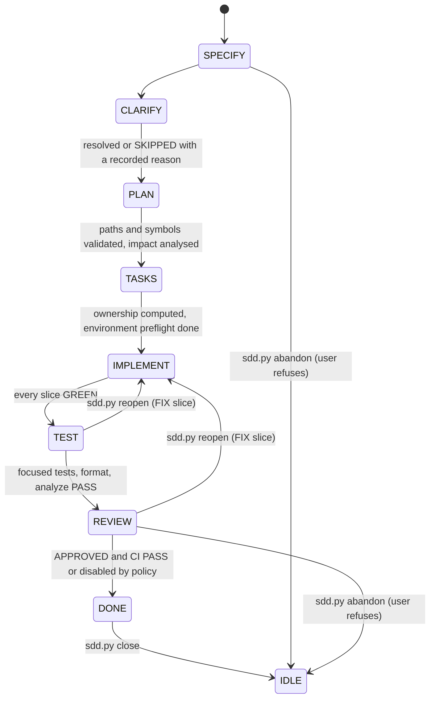

# FSM and bounded loop

[Docs index](../README.md) · Related: [Action journal](action-journal.md), [Stage agents](stage-agents.md), [Gates](gates-and-stack-detection.md), [Contracts](contracts-and-schemas.md)

**Files:** `policies/LOOP_POLICY.md`, `policies/BOUNDED_AUTOMATION.md`, `policies/BOUNDED_RUN_DRIVER.md`, `runtime/sdd.py`, `runtime/stop_reasons.py`, `runtime/bounded_run_planner.py`, `runtime/bounded_run_driver.py`, `runtime/bounded_loop_driver.py`, `runtime/terminal_progress.py`, `schemas/BOUNDED_RUN_PLAN_SCHEMA.json`.

`LOOP_POLICY.md` is the authoritative policy (English; mode logic as a table in §2, budgets and their reset rules in §4, the generated stop-reason table in §9). `sdd.py` is the controller's single entry point; the planner and drivers are **pure**: they read JSON snapshots and return decisions, and never run a worker, write STATE, touch Git or activate a mode.

## The FSM



Only `CLARIFY` may be skipped, and only with a recorded reason. A stage never transitions to itself (`sdd.py transition --to <current>` is refused with `STEP_MISMATCH`): a failed gate or a REVIEW asking for changes reopens the work with `sdd.py reopen --reason R --quote Q`, which opens the next `FIX<n>` slice in IMPLEMENT (moving back from TEST/REVIEW, or staying in IMPLEMENT for the DECISION_DOC profile), moves the last slice's checks to it and resets every gate. `sdd.py close` takes a DONE demand back to IDLE (summary kept in `closed_demands`, last 20) so `start` accepts the next one; `sdd.py abandon --reason R --quote Q` is the same exit for a demand that will **not** reach DONE (the user refuses the pending human decision, or drops the demand): it refuses a DONE demand (next command `close`), records `{reason, quote, by, stop_reason, pending_human_checks}` plus `outcome: ABANDONED`, `stage_reached` and `left_in_worktree` in `closed_demands`, reverts nothing in the worktree, and returns STATE to IDLE. Both exits clear the whole `ownership` block (including `human_accepted`), so a path accepted in one demand never arrives pre-accepted in the next one. A reopen clears `delivery.approved_slice_sha256s`: the FIX slice runs under the scope the reopen's own `--quote` authorized, so it is dispatched with `APPROVAL_NOT_REQUESTED` and never re-raises `SCOPE_CHANGE_REQUIRED`. Each stage has its own brief ([Stage agents](stage-agents.md)) and returns a [contract](contracts-and-schemas.md). Transition conditions are listed in `LOOP_POLICY.md` §6.

## Modes

| Mode | Behavior |
| --- | --- |
| `MANUAL` (default) | Progress only when the user asks; "continue"/"pode seguir" authorizes progress up to the next HUMAN stop, not a single action. |
| `PAUSED` | `sdd.py pause --quote Q` enters it. `sdd.py next` starts nothing (stop `LOOP_PAUSED`, no PREPARE/DISPATCH; only finishing an already committed result is allowed); `sdd.py resume --quote Q` returns to the previous mode on the user's explicit request. |
| `BOUNDED_AUTO`, schema 1 (legacy) | Continue through a deterministic plan the user approved. A new round needs a new preview and a new confirmation. |
| `LOCAL_DELIVERY`, schema 2 | Not a separate mode value: `schema_version: 2` + `local_delivery` + `loop.mode: BOUNDED_AUTO`. An explicit delivery request ("orquestre/implemente <demand>") is a single authorization bound to ticket, scope hash, worktree and **cumulative** limits; `sdd.py start` shows it once. Replanning never requests new approval and never resets usage. |

Default schema 1 budgets per round: 3 stage transitions, 8 executor calls, 1 corrective retry per action, 3 TDD slices, 1 investigation expansion per stage, 2 review cycles, 1 CI run, 0 external mutations. `used_current_action` resets on journal rollover and `used_current_stage` on a stage transition (`bounded_run_planner.reset_budgets`); other counters never reset within a demand. In LOCAL_DELIVERY `sdd.py start` sizes `stage_transitions` as the profile's forward transitions plus `review_cycles` × the IMPLEMENT → REVIEW re-advance (CODE 7 + 2×2 = 11, DECISION_DOC 5 + 2×1 = 7) and prints it in `limits_explained`, so every REVIEW reopen the review budget allows still reaches DONE without a raise; the backward reopen itself spends no transition. `ci_runs` is sized as `review_cycles` for the same reason: a CI failure followed by a pre-authorized REVIEW reopen must still be able to run CI, instead of stopping with `CI_RUN_BUDGET_REACHED` and cancelling the cycle the same authorization granted. `TOOLCHAIN_ENVIRONMENT` covers a missing or mismatched SDK or version manager for any language. §25 describes the harness checks around every dispatch, including per-slice approval hashes stored at PLAN/TASKS and `role` validation of read-only results.

### Delivery profiles

`--deliverable-kind` on `sdd.py start` selects the profile: `CODE` and `BOTH` run the full FSM; `DECISION_DOC` runs SPECIFY → CLARIFY → PLAN → IMPLEMENT (the document) → REVIEW → DONE and records TASKS and TEST as skipped with a reason. `state_format.apply_transition` enforces the profile, the CLARIFY skip reason and the reopen reason.

### Stop reasons (`stop_reasons.py`)

Stop reasons are a closed registry with exactly one kind (`PAUSED`, `BLOCKED`, `HUMAN`, `DONE`), next step and a non-empty next command each (its only `<...>` placeholders are the user's words, listed in `USER_PLACEHOLDERS`; `sdd.py next` fills gate, check, question index and budget name itself); `LOOP_POLICY.md` §9 is generated from it and `tests/test_stop_reasons.py` fails when a runtime emits an unregistered literal or the table drifts. Budget reasons use singular names (`EXECUTOR_CALL_BUDGET_REACHED`); `COST_BUDGET_REACHED`, `NO_NEW_HYPOTHESIS` and `NO_PROGRESS` come from the [correction loop](harness.md). `STATE_PATH_REQUIRED`, `STATE_PATH_UNSAFE` and `STATE_COMMIT_FILE_MISSING` reach the controller through journal recovery rather than a literal.

## Actions

`bounded_run_planner.py` classifies every action:

| Class | Actions | Executor |
| --- | --- | --- |
| `AUTO_SAFE` | `RECOVER_PENDING_ACTION`, `TEST_FOCUSED`, `FORMAT_CHANGED_FILES`, `ANALYZE`, `EVALUATE_DONE`, `EVALUATE_DONE_WITH_CI_DISABLED`, `STATE_TRANSACTION_UPDATE`, `VERIFY_BASELINE_OWNERSHIP`, `EVALUATE_BUDGETS`, `CLOSE_BOUNDED_RUN`, `OBSIDIAN_WRITE` (the project wiki is read and written; not an external mutation) | `HOST` |
| `AUTO_WITH_BUDGET` | `SPECIFY`, `CLARIFY`, `PLAN`, `TASKS`, `IMPLEMENT_SLICE`, `REVIEW`, `CI` | `CODEX` (`HOST` for `CI`) |
| `HUMAN_REQUIRED` | `REOPEN_STAGE_AFTER_RETRY_EXHAUSTED`, `RESOLVE_RECOVERY`, `PROTECTED_FILE_CHANGE`, `MATERIAL_SCOPE_CHANGE`, `ARCHITECTURE_DECISION`, `BACKEND_MUTATION`, `DEV_E2E`, `COMMIT`, `PUSH`, `LINEAR_UPDATE`, `DESTRUCTIVE_ACTION`, `EXTERNAL_CONTRACT_CHANGE`, `WAIT_OR_MANUAL_REVIEW` | `NONE` |

`OBSIDIAN_WRITE` is `AUTO_SAFE` because `LOOP_POLICY.md` §18 makes the project wiki read and write: stage artifacts, gate results, journal actions, incidents, decisions and Hermes turns are recorded there by [`wiki_journal.py`](obsidian-vault.md#recording-everything-in-the-wiki-wiki_journalpy), and a failed wiki write never stops the loop or DONE.

Gate preconditions are enforced by the planner: `FORMAT_CHANGED_FILES` needs focused tests `PASS`, `ANALYZE` needs tests and format, `REVIEW` needs all three, and `CI` needs review `APPROVED` and CI enabled. Gate commands come from [Gates](gates-and-stack-detection.md).

The snapshot's `implementation.changed_files_available` flag is also accepted under its legacy name `changed_dart_files_available`, so older installations keep validating.

## Tools

### `sdd.py` (controller entry point)

```text
sdd.py status                    # compact JSON: paths, stage/status/mode/ticket, recovery, budgets_left, next_action, next_command
sdd.py next                      # {step, commands[], end_turn, stop_reason, next_step, next_command}
sdd.py start --ticket ID --title T --objective O [--deliverable-kind CODE|DECISION_DOC|BOTH] [--request QUOTE] [--executor-calls N] [--tdd-slices N]
sdd.py snapshot [--output s.json]
sdd.py manifest --stage S [--role R] --output m.json
sdd.py transition --to STAGE --artifact PATH [--skip-reason R] [--reason R --quote Q]
sdd.py waive --check AC-n --by requester --quote "..." --reason "..."
sdd.py reopen --reason R --quote Q          # failed gate / REVIEW changes: FIX slice in IMPLEMENT, gates reset
sdd.py request-decision --check AC-n --reason R   # ask the user about a non-HUMAN check
sdd.py answer (--index N | --check AC-n) --quote Q
sdd.py gate --name G [--rerun --quote Q] [--not-applicable --by requester --quote Q]
sdd.py rebaseline --quote Q                 # accept drift, changed protected files or REVIEW ownership findings
sdd.py approve-scope --quote Q              # approve the current slice contracts after SCOPE_CHANGE_REQUIRED
sdd.py budget --raise NAME|prompt_bytes --by N --quote Q
sdd.py pause --quote Q | sdd.py resume --quote Q
sdd.py reprepare                            # archive a never-dispatched PREPARED action, refund its call
sdd.py close                                # DONE -> IDLE
sdd.py abandon --reason R --quote Q         # any stage -> IDLE after the user refuses; reverts nothing
sdd.py disown --path P --reason R           # drop one path from ownership.agent_owned (AGENT_OWNED_PATH_UNSAFE)
```

Subcommands `status`, `next`, `start`, `snapshot`, `manifest`, `prepare`, `accept`, `reject`, `transition`, `reopen`, `waive`, `request-decision`, `answer`, `unblock`, `budget`, `gate`, `confirm-policy`, `rebaseline`, `approve-scope`, `close`, `abandon`, `disown`, `pause`, `resume`, `reprepare`. Flags: `--repo`, `--ticket`, `--title`, `--objective`, `--deliverable-kind`, `--request`, `--executor-calls`, `--tdd-slices`, `--output`, `--stage`, `--role`, `--manifest`, `--to`, `--artifact`, `--skip-reason`, `--reason`, `--quote`, `--check`, `--by`, `--index`, `--raise`, `--name`, `--not-applicable`, `--rerun`, `--confirm-policy`, `--path`.

The controller runs `status` once, then loops on `next` and executes exactly the printed `commands`. Steps: `RECOVER`, `ROLLOVER`, `REPREPARE` (`reprepare` when policies/EXECUTORS.md switched the prepared action's executor), `PREPARE` (`manifest` → `stage_context.py check` → `prepare`, which builds the prompt and enforces `max_prompt_bytes`), `DISPATCH` (`executor_launch.py run`, printed only when the prepared executor is on PATH; otherwise the stop `EXECUTOR_UNAVAILABLE`), `VALIDATE` (`accept`, or `reject` → `CLASSIFY_INVALID`; an `ACCEPT` step commits), `GATES` (`gate`; a recorded result is re-run when its GATES.md row — command, timeout, NOT_APPLICABLE or the CI policy — changed, so enabling CI after REVIEW runs the CI gate instead of looping on `DONE_GATES_NOT_PASSED`; disabling it records `ci: DISABLED_BY_PROJECT_POLICY` at the DONE transition), `TRANSITION`. `start` captures the baseline (pre-existing dirty files become protected) only when STATE is IDLE and the journal pristine; a second demand is refused. Every output and error carries `next_step` and `next_command`. Error and stop codes include `IDLE_NO_DEMAND`, `MANIFEST_INVALID`, `PROMPT_BUDGET_EXCEEDED`, `JEV_GOVERNANCE_REQUIRED`, `CONTRACT_INVALID`, `WORKER_BLOCKED`, `CLARIFICATION_REQUIRED`, `HUMAN_DECISION_REQUIRED`, `SCOPE_CHANGE_REQUIRED`, `INVESTIGATION_BUDGET_EXCEEDED`, `EXECUTOR_TIMEOUT`, `EXECUTOR_FAILED`, `RETRY_BUDGET_REACHED`, `EXECUTOR_CALL_BUDGET_REACHED`, `STAGE_TRANSITION_BUDGET_REACHED`, `TDD_SLICE_BUDGET_REACHED`, `REVIEW_CYCLE_BUDGET_REACHED`, `CI_RUN_BUDGET_REACHED`, `ACTION_RECOVERY_REQUIRED`, `BASELINE_DRIFT_EXTERNAL`, `PREEXISTING_FILE_MODIFIED`, `STATE_INCONSISTENT`, `GATE_COMMAND_UNCONFIGURED`, `GATE_CONFIRMATION_REQUIRED`, `GATE_TIMEOUT`, `FOCUSED_TESTS_FAILED`, `FORMAT_FAILED`, `ANALYZE_FAILED`, `CI_FAILED`, `REVIEW_BLOCKED`, `REVIEW_CHANGES_REQUIRED`, `OWNERSHIP_VIOLATION`, `DONE_GATES_NOT_PASSED`, `CI_TIMEOUT`, `LOOP_PAUSED`, `EXECUTOR_UNAVAILABLE`, `CONTROLLER_POLICY_CHANGED_DURING_DEMAND`, `CONTROLLER_POLICY_UNPINNED`, `CONTROLLER_POLICY_CONFIRMATION_REQUIRED`, `CONTROLLER_POLICY_UNREADABLE`, `STATE_MODIFIED_DURING_ACTION`, plus the command errors `STEP_MISMATCH`, `DEMAND_ACTIVE` (next command `close` when the demand is DONE) and `WAIVE_REQUIRES_HUMAN_CHECK`.. Those refusals reach the controller as the `status` of an exit-2 payload, so they are registered in `runtime/stop_reasons.py` and listed in `LOOP_POLICY.md` §9 exactly like a `stop_reason`; `tests/test_stop_reasons.py` reads `raise SddError("CODE", ...)` as a sink, so a new code cannot be added without registering it.

Executor timeout: the first timeout is archived as interrupted and retried once as `FULL_REPLACEMENT` with reduced context (brief and pointers, no inline excerpts); a second one stops with `EXECUTOR_TIMEOUT`. `waive` records `{by, reason, quote, recorded_at}` for a HUMAN check, `by` must be the requester or a `PROJECT_SETUP.md` approver, and `stage_context.py verifier-context --state` hands it to `validate_protocol` as `recorded_waivers`. Every `HUMAN_DECISION_REQUIRED` stop also prints `refusal_command` (`sdd.py abandon`), so a user who refuses the decision is never a dead end: `waive` records an approval, `next` would only reprint the stop. An AGENT check is refused with `WAIVE_REQUIRES_HUMAN_CHECK` unless `request-decision` opened a `HUMAN_DECISION_REQUIRED` stop for it and `answer --check` recorded the user's words; the waiver quote must equal that answer and `delivery.decision_bindings` records the link. A `GATE_TIMEOUT`/`CI_TIMEOUT` re-runs on the next `next` once its GATES.md timeout changed, or with `gate --rerun --quote Q`. `BASELINE_DRIFT_EXTERNAL`, `PREEXISTING_FILE_MODIFIED` and `OWNERSHIP_VIOLATION` are resolved by `rebaseline --quote Q` (decision in `delivery.rebaselines`, new HEAD/branch and protected hashes, or accepted paths in `ownership.human_accepted` with REVIEW re-run). `gate --not-applicable` records the user's confirmation of a gate GATES.md marks `NOT_APPLICABLE`; the DONE check accepts it. Gate commands run on the host and `EXECUTORS.md` chooses the worker binary, its tools and its sandbox, so `sdd.py start` pins the SHA-256 of both files in `delivery.controller_policies` and every `gate` re-verifies them: a mismatch stops with `CONTROLLER_POLICY_CHANGED_DURING_DEMAND` naming the changed files, and a demand with no pin at all stops with `CONTROLLER_POLICY_UNPINNED` (an mtime cannot tell the owner's edit from a worker's). `sdd.py confirm-policy --name gates|executors --quote '<user words>'` (also `gate --confirm-policy <name>`) re-pins one named file from the user's words and runs nothing; confirming one never confirms the other. A policy file that cannot be hashed at all (missing, not a regular file, unreadable) is a different stop: `CONTROLLER_POLICY_UNREADABLE`, printed instead of a confirmation command because pinning the empty digest reads back as "no pin" and every gate would ask for the same confirmation forever. It carries one exact `git checkout -- <file>` per unreadable policy (`restore_commands`, `unreadable`, `policies`); `confirm-policy` on such a file is refused with the same code, so the recorded pin is never overwritten with `""`. Both policy stops are raised by `next` **before** any `gate` command is printed — the gate would only refuse with the same code at exit 2, which is a stop disguised as a command batch — and an unreadable GATES.md is named as such instead of as `GATE_COMMAND_UNCONFIGURED` (whose own resolution is `next`, hence a loop). This closes the `--local-storage` path where a writing IMPLEMENT/TEST worker, whose repository holds the controller, could rewrite `GATES.md` and get arbitrary host execution on the next gate. For the same reason `accept` verifies STATE against the `fingerprints.state_before` recorded at `prepare` and stops with `STATE_MODIFIED_DURING_ACTION` when anything outside the journal's state commit rewrote it; `next` raises that stop first too, so no step reads the tampered STATE. Its exit is the printed `sdd.py abandon --reason '<reason>' --quote Q`: the open action is archived as BLOCKED evidence (never redispatched, path and SHA-256 in `discarded_action`), its result is never folded into STATE, and every per-demand block returns to its IDLE default, so `sdd.py start` can re-run the demand. Nothing in the worktree is reverted and `closed_demands[-1].abandon` records `stop_reason: STATE_MODIFIED_DURING_ACTION` with the user's words. STATE is never repaired by hand. `{files}` expands to the agent-owned paths as separate arguments; a path with a segment starting with `-` is refused with `AGENT_OWNED_PATH_UNSAFE` instead of becoming an option, and the stop prints one `sdd.py disown --path <path> --reason R` per unsafe path (`disown_commands`), which drops it from `ownership.agent_owned` into `ownership.disowned_unsafe` and leaves the file itself in the worktree. In Obsidian mode the DISPATCH step passes the controller container to the launcher as `--read-dir`, never as a writable `--add-dir`.

### `bounded_run_planner.py` (Phase 2A: preview)

```text
bounded_run_planner.py plan --snapshot s.json --target NEXT_HUMAN_CHECKPOINT [--output plan.json] --json
bounded_run_planner.py validate --plan plan.json --snapshot s.json --json
bounded_run_planner.py classify --action SPECIFY --json
```

Subcommands `plan`, `validate` and `classify`. Flags: `--snapshot`, `--plan`, `--target`, `--output`, `--action`, `--json`. The plan is canonical JSON whose `plan_sha256` is computed without the authorization field. It validates against `BOUNDED_RUN_PLAN_SCHEMA.json` (plan version 1, or 2 for `LOCAL_DELIVERY`). Generate the snapshot with `sdd.py snapshot`; never build it by hand. The recovery enum is every `action_journal.py recover` decision: `DISPATCH_ALLOWED`, `RECONCILE_ARTIFACT`, `CORRECTIVE_RETRY_AVAILABLE`, `STATE_COMMIT_REQUIRED`, `ALREADY_COMMITTED`, `WAIT_OR_MANUAL_REVIEW`, `ARCHIVE_INTERRUPTED_REQUIRED`, `BLOCKED` and `RELEASED`; `RECONCILE_ARTIFACT`, `STATE_COMMIT_REQUIRED` and `ARCHIVE_INTERRUPTED_REQUIRED` plan `RECOVER_PENDING_ACTION` first. An `IDLE` snapshot is refused with `IDLE_NO_DEMAND` and the `sdd.py start` command; every error carries `next_step` and `next_command`. A human-confirmed `NOT_APPLICABLE` format or analyze gate counts as passed.

### `bounded_run_driver.py` (Phase 2B: per-action decision)

```text
bounded_run_driver.py bind --snapshot s.json --plan plan.json --started-at <iso> [--approved-plan-sha256 <sha>] --json
bounded_run_driver.py inspect|validate|next --snapshot s.json --plan plan.json --json
```

Subcommands `bind`, `inspect`, `validate` and `next`. Flags: `--snapshot`, `--plan`, `--started-at`, `--approved-plan-sha256`, `--json`. `bind` attaches a validated plan to a runtime cursor. Schema 1 requires the exact approved hash.

Decisions: `EXECUTE_NEXT`, `ROLLOVER_REQUIRED`, `REPLAN_REQUIRED`, `COMPLETE`, `STOP_BUDGET`, `STOP_HUMAN_REQUIRED`, `STOP_BLOCKED`, `STOP_PLAN_STALE`, `STOP_RECOVERY`. This is the only bounded-run driver; every decision carries `next_step` and `next_command`, a recovery stop uses `RECOVERY_RECONCILIATION_REQUIRED`, and gate failures map to the named reasons of §9.

### `bounded_loop_driver.py` (deprecated)

```text
bounded_loop_driver.py next --snapshot s.json --plan plan.json --json
```

Deprecated (`DEPRECATED = True`): superseded by `bounded_run_driver.py` and `sdd.py next`; kept so pre-v14 automation keeps working, and its stops now carry `next_step`. Subcommand `next`. Flags: `--snapshot`, `--plan`, `--json`. Decisions: `CONTINUE`, `STOP`, `ROLLOVER_REQUIRED`. Expected progress (STATE hash, budgets used, recovery after rollover) is not stale. Workspace identity drift is.

## Per-action loop

`sdd.py next` prints the whole sequence for the current step, so the controller never assembles it: [journal recovery](action-journal.md) → manifest and [stage context check](harness.md#stage-context-manifest-schema-2-stage_contextpy) → `prepare` → one `executor_launch.py run` → validate the [contract](contracts-and-schemas.md) → STATE commit through the journal → `release` → `rollover` → gates → transition → `next` again. A valid result whose verification fails goes through the [bounded correction loop](harness.md#bounded-correction-loop-correction_looppy) before any retry. A healthy success never ends a bounded round by itself; only a stop does. `tests/test_controller_e2e.py` drives a demand from `start` to DONE executing only printed commands, including one injected executor timeout, one waived HUMAN check, a format-gate timeout re-run with the user's confirmation, a REVIEW `CHANGES_REQUIRED` reopen (FIX slice) reaching DONE without a budget raise, and `close` → a second `start`; a DECISION_DOC demand recovers from one failed analyze gate through an in-stage FIX slice.

## Terminal progress

`terminal_progress.py` is the presentation layer for the classic Hermes CLI. Its private `TERMINAL_PROGRESS.json` is not authoritative orchestration state: `STATE.md`, the action journal and the bounded drivers still decide what may happen. The controller starts one display run with the actual Hermes provider, records a concise activity before each command/dispatch/gate/material action, advances it with each valid FSM transition and closes it as `DONE`, `BLOCKED` or `PAUSED`.

The dashboard renders the provider, current stage as `N/8`, remaining-stage count, elapsed time for the current stage, completed/skipped/blocked/paused stage durations, the five most recent activities, and Jev's active/completed state, provider, model, classification area and question IDs. Only the normal next transition is accepted, except the declared `SPECIFY → PLAN` path that records `CLARIFY` as skipped; no other stage can disappear from the display. `finish --status DONE` accepts REVIEW or DONE only, closes REVIEW when needed, and always renders `DONE (8/8)` with zero remaining stages. On POSIX, every read-modify-write holds one owner-private sibling lock and one no-follow parent descriptor through validation and atomic mode-`0600` replacement, so concurrent activity is not lost and a symlinked ancestor cannot redirect state. The dashboard fails closed as `PROGRESS_PLATFORM_UNSUPPORTED` on Windows rather than claiming junction-safe handling; this optional display limitation does not affect the skill's Windows installer/controller support. Every rendered free-text field is bounded, non-blank and `isprintable()`, rejecting ASCII/C1 controls, Unicode separators and bidi controls. Color is TTY-aware, `--no-color` disables it explicitly, and one named `NO_COLOR` lookup honors the standard environment convention without broad environment access. `--json` exposes the same validated state for automation. A semantic-governor cache miss updates Jev before and after its network call; a cache hit does not claim a live Jev use.

```text
terminal_progress.py start --provider <provider> --stage SPECIFY
terminal_progress.py activity --message <summary>
terminal_progress.py stage --name <next-stage>
terminal_progress.py show
terminal_progress.py finish --status DONE|BLOCKED|PAUSED
```

Subcommands: `start`, `stage`, `activity`, `jev-start`, `jev-finish`, `finish`, `show`. Common flags are `--file`, `--json` and `--no-color`. `start` accepts `--provider`, `--stage` and optional `--activity`; `stage` accepts `--name` and `--previous-status`; `activity` requires `--message`; `jev-start` requires `--provider`, `--area` and one or more `--question`; `jev-finish` requires `--status` and accepts `--model`; `finish` requires `--status`.
