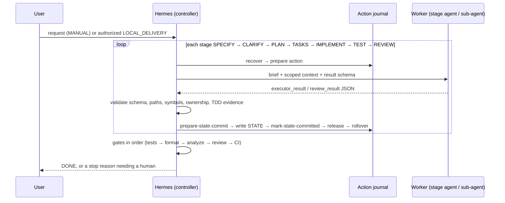

# Overview

[Docs index](README.md) · [Architecture](ARCHITECTURE.md) · [Glossary](glossary.md)

The Hermes SDD Orchestrator makes Hermes act as a **controller** for Spec-Driven Development in any Git project, in any language. Hermes does not write the code itself. It drives one worker at a time (Codex by default, Claude optionally) through a fixed sequence of stages, checks every result against a schema and against the repository, and stops whenever a human decision is needed.

## Three ideas

1. **Controller and workers are separate.** Only the controller changes [STATE](glossary.md#state), decides transitions and dispatches workers. Workers get a narrow brief ([stage agents](components/stage-agents.md) or [sub-agents](components/sub-agents.md)) and return one JSON document ([contracts](components/contracts-and-schemas.md)).
2. **Every action is recoverable.** Before a worker runs, the action is written to a [write-ahead journal](components/action-journal.md), so an interruption never leads to a duplicate dispatch or a lost result.
3. **Nothing is "done" without evidence.** Each implementation slice needs a failing test and then a passing test. After that, tests, formatter, analyzer, review and optionally CI must pass, in [a fixed order](components/gates-and-stack-detection.md).

## Where things live

| Location | What | Page |
| --- | --- | --- |
| Hermes profile | The skill (`SKILL.md`, installer, templates) | [Skill and installer](components/skill-and-installer.md) |
| Target project, untracked | `.hermes.md` + `.hermes/orchestration/` (policies, runtime, schemas, briefs, tests) | [Skill and installer](components/skill-and-installer.md) |
| Target project, versioned | `.hermes/obsidian.json` (optional vault binding) | [Obsidian vault](components/obsidian-vault.md) |
| Target project or vault | `STATE.md`, `ACTION_JOURNAL.json`, `INCIDENTS.md` | [Action journal](components/action-journal.md), [Obsidian vault](components/obsidian-vault.md) |

## Life of a demand

1. **Install once per project.** See [Skill and installer](components/skill-and-installer.md).
2. **Configure the gates** for the project's language. See [Gates and stack detection](components/gates-and-stack-detection.md).
3. **Start a demand.** In `MANUAL` mode the controller runs one requested action and stops. `BOUNDED_AUTO` and `LOCAL_DELIVERY` continue until a checkpoint. See [FSM and bounded loop](components/fsm-and-loop.md).
4. **Each action** goes through the journal lifecycle described in [Action journal](components/action-journal.md).
5. **Each worker** receives exactly one brief. The controller picks a specialist only when a pending decision depends on the answer. See [Sub-agents](components/sub-agents.md).
6. **DONE** means the engineering is validated. It does not mean committed or pushed: commit, push and external writes always need separate human approval.

## Safety invariants

These hold everywhere and are enforced in code, not only in prose:

- One leaf worker at a time. Workers never spawn workers.
- Pre-existing dirty, staged or untracked files are protected and read-only.
- No commit, push, backend mutation, external update or unapproved E2E test without explicit authorization.
- No polling, background waits, force flags or `git reset`/`checkout` to resolve a conflict.
- The installer never overwrites configuration and never modifies tracked files.

Continue with [Architecture](ARCHITECTURE.md) for how the layers depend on each other.
